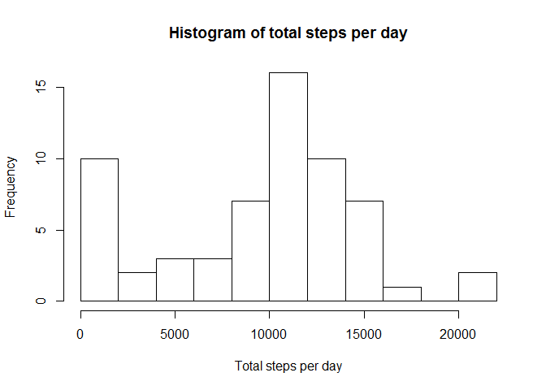
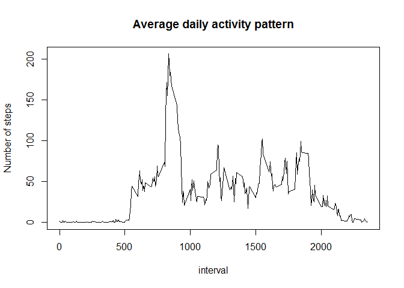
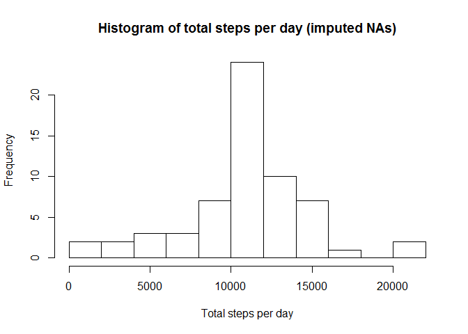
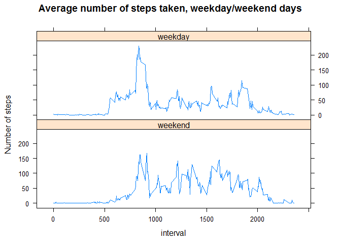

# Reproducible Research: Peer Assessment 1


## Loading and preprocessing the data

We load the data from the zip archive in the working directory.


```r
con <- unz("activity.zip", "activity.csv")
dat <- read.csv(con)
rm(con)
```

Transform the data into data.table


```r
library(data.table)
dt <- data.table(dat)
rm(dat)
```

## What is mean total number of steps taken per day?

Calculate the total number of steps taken per day. NAs are removed in the 
summation.


```r
daysum <- dt[, sum(steps, na.rm=TRUE), by = date]
```

Plot a histogram of the total number of steps taken each day.


```r
hist(daysum$V1, breaks=10,
     main="Histogram of total steps per day",
     xlab = "Total steps per day")
```

 

Calculate the mean and median of the number of steps taken per day.


```r
meansteps <- mean(daysum$V1)
mediansteps <- median(daysum$V1)
```

The mean of the total number of steps taken per day is 9354.2295082 and the 
median is 10395.

## What is the average daily activity pattern?

Calculate the average number of steps per interval across all days.


```r
daypattern <- dt[, mean(steps, na.rm=TRUE), by=interval]
```

Plot the average daily activity pattern.


```r
plot(daypattern, type="l", ylab="Number of steps",
     main = "Average daily activity pattern")
```

 

Calculate which of the intervals, on average, contains the maximum number of 
steps.


```r
maxint <- daypattern[daypattern[,which.max(V1)],interval]
```

The interval with maximum number of steps per day, averaged accros all days, is
835.

## Imputing missing values

Calculate the total number of missing values.


```r
NAnum <- sum(is.na(dt$steps))
```

There are 2304 missing values in the dataset.

Fill the missing values with the mean of that 5-minute interval.


```r
setkey(dt, interval)
setkey(daypattern, interval)
dtpattern <- dt[daypattern]
invisible(dtpattern[order(date,interval)])
dtpattern$steps[is.na(dtpattern$steps)] <- dtpattern$V1[is.na(dtpattern$steps)]
invisible(dtpattern[order(date)])
dtimp <- dtpattern[,V1:=NULL]
invisible(dtimp[order(date)])
```

Calculate the total number of steps taken per day in the dataset with the 
imputed NAs.


```r
daysumimp <- dtimp[, sum(steps, na.rm=TRUE), by = date]
```

Plot a histogram of the total number of steps taken each day (with the imputed 
dataset).


```r
hist(daysumimp$V1, breaks=10,
     main="Histogram of total steps per day (imputed NAs)",
     xlab="Total steps per day")
```

 

Calculate the mean and median of the number of steps taken per day (imputed NAs).


```r
meanstepsimp <- mean(daysumimp$V1)
medianstepsimp <- median(daysumimp$V1)
```

The mean of the total number of steps taken per day according to the imputed 
dataset is 1.0766189\times 10^{4} and the median is 1.0766189\times 10^{4}. So imputing 
the NAs the mean and the median of the total number of steps per day are with correspondingly 1411.959171 and 371.1886792 higher than in a dataset without imputation. 

## Are there differences in activity patterns between weekdays and weekends?

First we add a factor for weekdays and weekends in the dataset with the imputed 
missing values.


```r
wend_list <- c('Saturday', 'Sunday')
dtimp$wend <- factor((weekdays(as.Date(dtimp$date)) %in% wend_list), 
         levels=c(TRUE, FALSE), labels=c('weekend', 'weekday')) 
```

Calculate the average number of steps per interval across all weekday days and all weekend days in the dataset with the imputed missing values.


```r
daypatternimp <- dtimp[, mean(steps), by=list(interval, wend)]
```

And make a plot of the calculated average number of steps (from the dataset with the imputed missing values).


```r
library(lattice) 
xyplot(V1~interval|wend,
       data = daypatternimp,
       type = "l",
       layout=c(1,2),
       main="Average number of steps taken, weekday/weekend days",
       ylab="Number of steps") 
```

 
